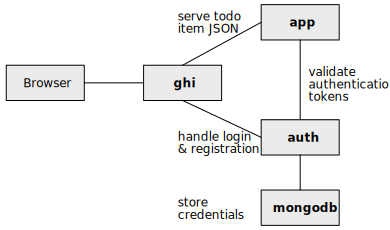

# Compose Some Microservices!

In this exercise, you're going to use **docker-compose** to provision and manage
some microservices. There are two dynamic services, one static service, and a
service that hosts MongoDB.



**Fork this application to your own repository. That will be what you submit.**

Please read this entire file before starting.

## Composing the applications

Each of the services has some _Dockerfile_ in it that you will use for your
**docker-compose** file.

It would be illustrative for you to examine the different _Dockerfiles_ so that
you can see the different things each does.

### A MongoDB container for credentials

Here are the requirements for a MongoDB container in your **docker-compose**
file:

* The name of the service that holds the MongoDB must be **mongodb**
* Use the `mongo:4-bionic` image from hub.docker.com
* Mount the `/data/db` directory _in the container_ to the local `./auth/data`
  directory on your file system (this will let MongoDB get access to any previously
  created data)

### The authorization app

Here are requirements for the authorization app in your **docker-compose** file:

* The name of the service must be **auth**
* Use the **Dockerfile.dev** file in `./auth` to build the service's image
* You must define the two following environment variables:
  * `JWT_SECRET` must be some string value that will be used to sign and
    validate the authorization bearer tokens
  * `MONGODB_URL` must be the valid MongoDB URL for your MongoDB container, such
    as `mongodb://mongodb/prodev-composed-auth`

### The to-do item app

Here are requirements for the todo app in your **docker-compose** file:

* The name of the service must be **app**
* Use the **Dockerfile.dev** file in `./app` to build the service's image
* Mount the following volumes for the container:
  * `./app/data:/usr/src/app/data`
  * `./app/src:/usr/src/app/src`

### The front-end

The front-end is based on an NGINX image and is the only one for which you need
to map the ports for access. It also acts as a reverse proxy for the
authentication and todo services. Here are the requirements for the front-end in
your **docker-compose** file:

* Use the **Dockerfile** file in `./ghi` to build the service's image
* Map port 80 in the container to the port 8910
* Mount the `/usr/share/nginx/html` directory _in the container_ to the local
  `./ghi/static` directory on your file system

## Some helpful commands

Sometimes you'll want to remove all of the containers that **docker-compose**
has built so that you can get a clean build. To do that, run

```sh
docker-compose rm -f
```

If you want to get a really clean point, run the following command from the root
of this repository.

```sh
for image in `docker image ls | grep "$(basename $(pwd))_" | awk -s '{ print $1; }'`                                                                                              
do
  docker image rm $image
done
```

This will remove all of the images and force another build from the "ground up".

## You're done when...

You can run the application from http://localhost:8910.

Once you're done, submit your repository's URL in the learning management
system.
